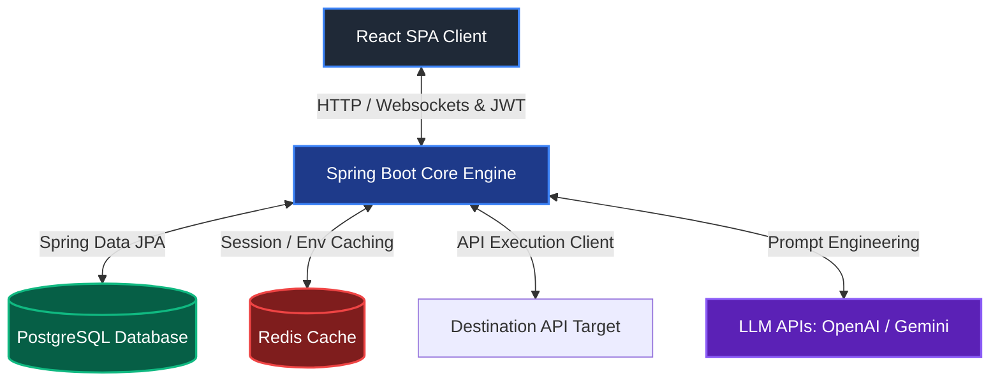

# Hi there! I'm Chaitanya 👋
### Full Stack Developer & Computer Science Student

  
  
  

---

## 💫 About Me

I am a passionate **Full Stack Developer** studying at **Lovely Professional University** (Punjab, India). I love building scalable web applications and continuously learning new technologies to solve real-world problems.

---

## 💻 Interactive Terminal (CS Skills Dashboard)

  <table width="100%" style="border-collapse: collapse; border: 1px solid #2c3e50; border-radius: 6px; background-color: #0f1419; color: #abb2bf; font-family: 'Fira Code', monospace; font-size: 14px;">
    <tr>
      <td style="padding: 15px; border-bottom: 1px solid #2c3e50; background-color: #1a233a; display: flex; align-items: center; justify-content: space-between;">
        

          
          
          
        

        chaitanya@developer: ~
        
      </td>
    </tr>
    <tr>
      <td style="padding: 20px; line-height: 1.6;">
        <pre style="margin: 0; white-space: pre-wrap; font-family: 'Fira Code', monospace;">
<b>chaitanya@developer</b>:<b>~</b>$ ./diagnostics --skills

<b>[System Profile]</b>
------------------
<b>OS</b>        : Lovely Professional University (LPU, Punjab, India)
<b>Role</b>      : Full Stack Software Engineer
<b>Interests</b> : Web Development | Algorithms & Data Structures | Software Architecture

<b>[Tech Stack & Tools (Animated)]</b>
--------------------------------
<b>Languages</b> : 
<b>Frontend</b>  : 
<b>Backend</b>   : 
<b>Databases</b> : 
<b>Tools</b>     : 
        </pre>
      </td>
    </tr>
  </table>

---

## 🛡️ Featured Project: PulseAPI (AI-Powered API Engineering Platform)

**PulseAPI** is a full-stack, microservice-friendly API engineering platform designed to streamline API development, testing, and debugging. By integrating LLM (Large Language Model) intelligence, it automates manual processes like code documentation, dynamic test generation, and intelligent error explanation, upgrading traditional REST client tools.

### 🏗️ System Architecture & Data Flow

### 🛠️ Technology Stack & Purpose

| Layer | Technology | Engineering Purpose |
| :--- | :--- | :--- |
| **Frontend** | React, TypeScript, Tailwind CSS | Type-safe state management, fluid responsive UI, and interactive visualization charts. |
| **Backend Core** | Java 21, Spring Boot | Multi-threaded client request processing, robust security middleware, and microservice ready architecture. |
| **Security** | Spring Security, JWT, OAuth2 | Stateless authentication, role-based resource protection (RBAC), and secure workspace isolation. |
| **Database** | PostgreSQL, Hibernate (JPA) | Structured schema mapping for workspace configurations, user collections, environments, and nested logs. |
| **Caching & Sync** | Redis | Caching workspace environmental variables, API keys, and session metadata for sub-millisecond lookups. |
| **Integrations** | OpenAI / Gemini API, Swagger | Orchestrating LLMs for error diagnostics, automated schema creation, and live OpenAPI spec parsing. |

### 🚀 Key Engineering Accomplishments

*   **Stateless Request Engine**: Programmed an asynchronous client request parser capable of handling custom payloads, complex files (multipart data), and contextual header inheritance across workspaces.
*   **AI-Powered Diagnostics**: Built an intelligent middleware analyzing raw JSON error responses and HTTP stack traces, mapping them through targeted prompts to output human-friendly solutions and fixes.
*   **Automated Schema & Test Generation**: Implemented a generator transforming custom collection patterns directly into structured Swagger/OpenAPI documentation and generating JUnit/Postman-style automated test scripts.
*   **Reactive Environment Resolution**: Designed a caching parser with Redis to dynamically intercept and substitute environment-specific variables (e.g., `{{baseUrl}}`) inside requests on-the-fly with zero database overhead.

---

## 🧠 Computer Science Fundamentals

Here are the core areas of computer science that I study and apply daily:

*   **📁 Data Structures & Algorithms (DSA)**: Arrays, Linked Lists, Trees, Graphs, Sorting/Searching, and Dynamic Programming.
*   **🏗️ System Design & Architecture**: Designing scalable, distributed backend architectures, MVC, and RESTful web API structures.
*   **⚙️ Object-Oriented Programming (OOP)**: Inheritance, Polymorphism, Encapsulation, and Abstraction in Java.
*   **💾 Database Management (DBMS)**: Relational MySQL queries, non-relational MongoDB schema modeling, and indexing.

---

## 🎓 Education & Other Projects

  
<b>🎓 Education Details</b>

   
  <ul>
    <li><b>Lovely Professional University (LPU)</b> — B.Tech in Computer Science and Engineering</li>
    <li>Focus: Full Stack Development, Java Programming, Database Management, and Web Technologies.</li>
  </ul>

  
<b>💻 Other Key Projects</b>

   
  <ul>
    <li><b>Developer Portfolio (with Live GitHub Analytics & Snake Game)</b> — A fully responsive portfolio site built using React.js and custom CSS animations, featuring a client-side GitHub analytics dashboard. It processes live GitHub API streams to map user metrics, hourly commit activity, and language distributions via custom SVGs, overlaid with an interactive snake game that traverses the user's active contribution grids.</li>
    <li><b>DevFlow</b> — A full-stack developer forum and QA platform.</li>
    <li><b>Spring Boot & Laravel Backends</b> — Multiple API services built with REST architecture, JWT authentication, and OAuth.</li>
  </ul>

---

## 📊 GitHub Analytics

  
  

  

---

## 🤝 Connect with Me

  
  
  

  Configured with ❤️ by Antigravity

